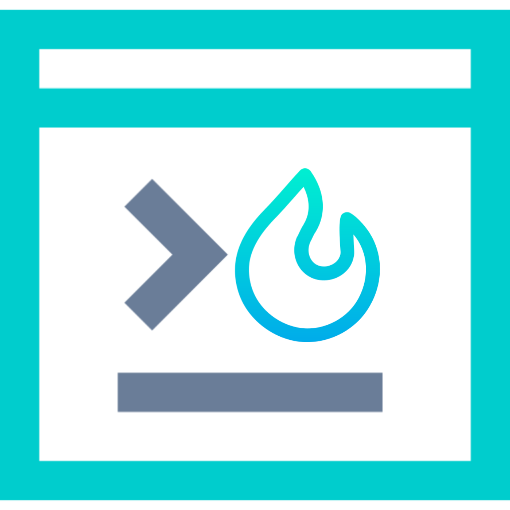

# PsBurn - Powershell Script Packager

<p align="center">
  
</p>

<p align="center">
  <a href="https://github.com/360modder/psburn/releases">
    
  </a>
  <a href="https://github.com/360modder/psburn/releases">
    
  </a>
</p>

psburn is a tool to package powershell scripts into executables by binding it with a c# or python program.

Vist psburn's [website](https://360modder.github.io/psburn/) for more details.

## Installations

First setup a [building envoirnment](https://360modder.github.io/psburn/gettingstarted/installations/#building-envoirnments) then you can download and install a psburn package for any of the following platforms.

| Supported Platform | Download                                                                                        | How to Install           |
|--------------------|-------------------------------------------------------------------------------------------------|--------------------------|
| Windows (x64)      | [.exe](https://github.com/360modder/psburn/releases/download/v1.0.0/psburn.1.0.0.win-x64.exe)   |                          |
| Debian             | [.deb](https://github.com/360modder/psburn/releases/download/v1.0.0/psburn.1.0.0.linux-x64.deb) | [Instructions][packages] |
| Red Hat            | [.rpm](https://github.com/360modder/psburn/releases/download/v1.0.0/psburn.1.0.0.linux-x64.rpm) | [Instructions][packages] |

You can also download the psburn binary archives for Windows, Linux and MacOS.

| Supported Platform | Download                                                                                                                                                                                        | How to Install                  |
|--------------------|-------------------------------------------------------------------------------------------------------------------------------------------------------------------------------------------------|---------------------------------|
| Windows            | [32-bit](https://github.com/360modder/psburn/releases/download/v1.0.0/psburn.1.0.0.win-x86.zip)/[64-bit](https://github.com/360modder/psburn/releases/download/v1.0.0/psburn.1.0.0.win-x64.zip) | [Instructions][binary-archives] |
| Linux              | [64-bit](https://github.com/360modder/psburn/releases/download/v1.0.0/psburn.1.0.0.linux-x64.tar.gz)                                                                                            | [Instructions][binary-archives] |
| MacOS              | [64-bit](https://github.com/360modder/psburn/releases/download/v1.0.0/psburn.1.0.0.osx-x64.tar.gz)                                                                                              | [Instructions][binary-archives] |

To install a specific version, visit [releases](https://github.com/360modder/psburn/releases).

[binary-archives]: https://360modder.github.io/psburn/gettingstarted/installations/#binary-archives
[packages]: https://360modder.github.io/psburn/gettingstarted/installations/#packages

## Usage

Following commands are in reference of powershell script named **script.ps1**

- Windows

```bash
psburn create script.ps1 -o script.cs
psburn build script.cs script.ps1
```

- Linux/MacOS

```bash
psburn cross script.ps1 -o script.py
psburn cbuild script.py script.ps1 --no-prompt
```

Your powershell script will be packaged under dist folder of working directory. [Learn More](https://360modder.github.io/psburn/gettingstarted/packagepsscripts/)

## Quick Links

- [Package Powershell Scripts](https://360modder.github.io/psburn/gettingstarted/packagepsscripts/)
- [Argparse Integration](https://360modder.github.io/psburn/gettingstarted/argparseintegration/)
- [Creating Self Contained Executable](https://360modder.github.io/psburn/usage/creatingselfcontainedexecutable/)
- [No Extract](https://360modder.github.io/psburn/usage/noextract/)
- [CLI API Documentation](https://360modder.github.io/psburn/documentation/python/cross/)

## Building From Source

You can build psburn release binaries from source by following the given instructions.

Requires*

- ubuntu-18.04
- python3.6+

Clone the psburn github repository.

```bash
git clone https://github.com/360modder/psburn.git
```

Now execute release.sh from psburn/release

```bash
cd psburn/release && chmod +x release.sh && ./release.sh
```
