# Workflow

Before understanding the workflow you have to understand the working of psburn. psburn itself does't compile the powershell scripts but it encapulates the psscript inside a python or c# program and then compile those programs with specific toolchains.

## Working With Commands

psburn comes with two methods for compiling pscripts, the first one is using using python and pyinstaller and the second one is using c# compiler (mono on linux/macos).

- **psburn cross** command works for python
- **psburn create** command works for c#

*cross* and *create* commands generates specific code for your script to run, then you can build a executable from those files.

- **psburn cbuild** command works for python
- **psburn build** command works for c#

You can understand the psburn commands toolchain from the below diagram.

## What happens during executing compiled powershell script ?

Since psburn doesn't actually compile powershell script it stores a copy of powershell script inside it as embedded resource and extract this script to a temporary directory and run it from there.
